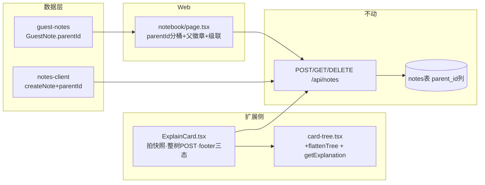
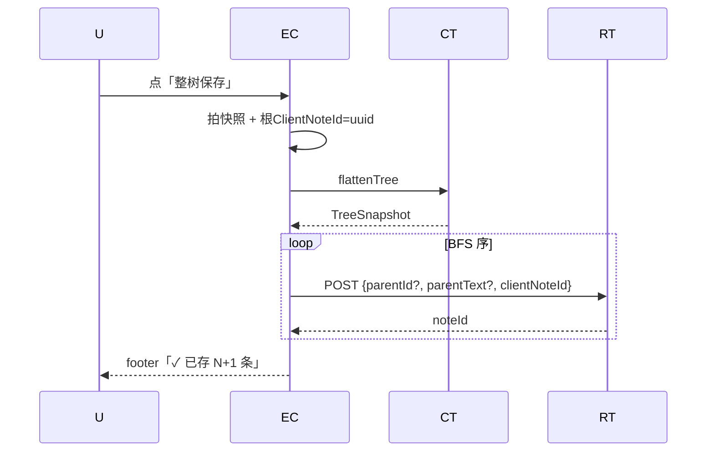
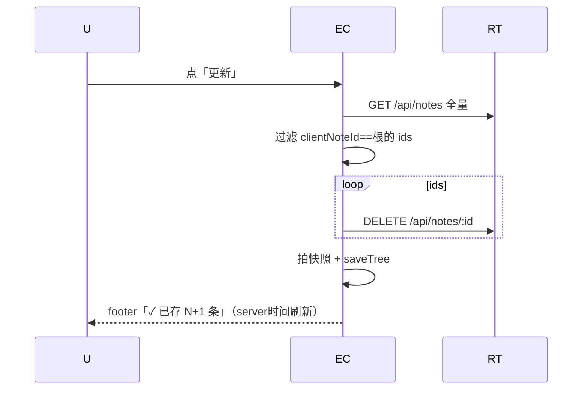
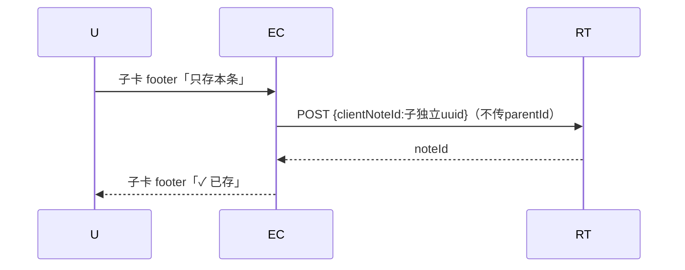
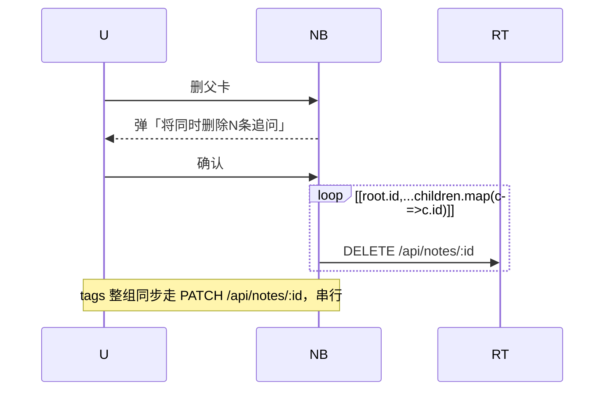

# 追问整树保存 — Architecture（增量设计）

> [context](./追问整树保存-context.md) 4 项用户决策 + 8 项 PM 决策已锁；[plan](./追问整树保存-plan.md) 5 阶段顺序不可推翻。
> 底线：API/DB **零改动**；依赖包 **空集**；最大复用，最小变更。

## 1. 实现方案



**三方协作**：扩展侧负责拍快照 + 递归 POST + footer 状态机；Web 侧负责客户端聚合 + 级联操作；后端零改动（`parentId/parentText/clientNoteId` 入参已支持）。

## 2. 文件清单（[改]/[不动] + 一句话）

| 文件 | 类型 | 职责 |
|---|---|---|
| `chrome-extension/src/content/ExplainCard.tsx` | [改] | 拍快照 → 整树 POST 循环；footer 三态 + 更新按钮；子卡独立入口 + 失败标红重试 |
| `chrome-extension/src/content/card-tree.tsx` | [改] | `CardNodeRecord` 加 `getExplanation`（ref 持锁）；新增 `flattenTree` 纯函数 |
| `app/notebook/page.tsx` | [改] | 按 `parentId` 分桶；`TreeNoteCard` 父徽章 + 折叠；级联删二次确认；tags 整组 PATCH |
| `lib/api/notes-client.ts` | [改] | `createNote` payload 加 `parentId?: string`（仅签名扩展） |
| `lib/guest-notes.ts` | [改] | `GuestNote.parentId?` + 新增 `saveGuestNotes` 批量 + `removeGuestNotes` |
| `__tests__/card-tree.test.ts` | [改] | 加 `flattenTree` 单测 4 例 |
| `docs/map/ext-content.md` | [改] | 同步 ExplainCard / card-tree 变更 |
| `docs/map/web-ui.md` | [改] | 同步 page.tsx 聚合 |
| `docs/map/lib-core.md` | [改] | 同步 notes-client / guest-notes 扩展 |
| `app/api/notes/route.ts` | [不动] | `parentId/parentText/clientNoteId` 已支持 |
| `lib/db/notes.ts` | [不动] | `saveNote` 已正确 |
| `components/ExplanationCard.tsx` | [不动] | Web 解释卡无追问树 |

## 3. 关键数据结构

```ts
// 拍快照的不可变表（BFS 序：根在前，子卡层后按兄弟序）
interface TreeSnapshotItem {
  cardId: string;              // 注册表里的 cardId（前端身份）
  text: string;                // inputText
  explanation: string;         // 当前 explanation（拍快照瞬间）
  parentCardId: string | null; // 父 cardId；根 = null
  depth: number;               // 0 = 根
  clientNoteId: string;        // 根用一次性 uuid，整树共用
  parentText: string | null;   // 父卡 explanation（parentText 入参）
}
interface TreeSnapshot { rootId: string; items: TreeSnapshotItem[]; capturedAt: number; }

// CardNodeRecord 扩展：ref 持锁避免 React 闭包陈旧
interface CardNodeRecord {
  // ... 既有字段
  getExplanation: () => string;  // explanationRef.current
}

// 整树 POST 结果
interface SaveTreeResult {
  successIds: string[];
  failed: Array<{ cardId: string; error: string }>;  // 'parent-failed' | 'HTTP xxx' | 'network'
}
```

**flattenTree 签名**：`flattenTree(nodes: CardTreeNodeData[], explanations: Map<string,string>, rootExplanation: string): TreeSnapshotItem[]`（BFS 序，根先子后，同层按注册序）。

**CardNodeRecord.getExplanation 实现**：ExplainCard 内 `const explanationRef = useRef(''); explanationRef.current = explanation;` 每次渲染同步 ref 内容；注册时传 `getExplanation: () => explanationRef.current`（不入 effect 依赖，避免重注册风暴）。

**整树 POST 循环伪代码**：
```ts
const cardIdToNoteId = new Map<string,string>();
for (const item of snapshot.items) {  // BFS：根必先
  const parentNoteId = item.parentCardId ? cardIdToNoteId.get(item.parentCardId) : undefined;
  if (item.parentCardId && !parentNoteId) { failed.push({cardId, error:'parent-failed'}); continue; }
  const res = await POST /api/notes { inputText, explanation, parentId:parentNoteId, parentText, clientNoteId, tags };
  if (!res.ok) failed.push({cardId, error:`HTTP ${status}`});
  else cardIdToNoteId.set(item.cardId, data.id);
}
```

## 4. 关键调用流程

### 4.1 整树保存（主流程）


### 4.2 更新到笔记本（整树覆盖）


### 4.3 子卡「只存本条」（独立 clientNoteId）


### 4.4 Web 整组级联（删除 + tags PATCH）


## 5. 共享知识（跨文件约定）

- **整树按钮 `disabled={isSaving || isCapturingSnapshot}`**，拍快照期间锁。
- **「整树」按钮显示条件**：`depth===0 && children.length>=1`。
- **「更新到笔记本」按钮显示条件**：`depth===0 && savedId!=null`。
- **子卡「只存本条」**：depth>0 footer 恒显；不传 parentId；clientNoteId 独立 uuid。
- **Web 笔记本聚合**：root = `!n.parentId`；root 行显示「追问对话 · N 条」徽章；N = 同 clientNoteId 的子卡数。
- **分类筛选**：root 命中 → 整组可见；root 未命中 → 整组隐藏（子卡不参与筛选）。
- **整树 POST 失败策略**：**允许部分成功**。footer「✓ 已存 X/Y」+ 失败子卡 footer 红框 + 「重试」按钮（仅重试该条）。
- **更新 = 整树覆盖**：按 clientNoteId 反查 → 全删 → 重存（决策 #1）。
- **clientNoteId 共享**：根一次性 `crypto.randomUUID()`，整树所有 note 含孙卡共用；子卡「只存本条」独立 UUID，不进整树 clientNoteId 集合。
- **guest / 账号同语义**：`saveGuestNotes` 共享根 clientNoteId + parentId；`migrateGuestNotes` 已预留 clientNoteId 树锚。
- **找重复 `findDuplicate` 仅在根触发**（现有 line 280 `!n.parentText` 已正确，子卡 inputText 重复不查重，决策 #6）。

## 6. 回滚方案

```ts
// chrome-extension/src/content/ExplainCard.tsx footer 渲染处
const WHOLE_TREE_ENABLED = false;  // 一行开关，false 时退回原单态
```

`WHOLE_TREE_ENABLED=false` 时 footer 退回「存入笔记本」+ 老 `handleSave`；API/DB 0 改动无副作用。

## 7. 设计权衡（architect 补充 / 新发现）

| # | 接缝 | 决策 |
|---|---|---|
| W1 | **注册表陈旧闭包** | `getExplanation` 不能用直接闭包（React state 在异步保存期间会变）。**ref 持锁**：`useRef(explanation); ref.current=explanation;`，getter 通过 ref 读最新值。effect 依赖不加 getExplanation 避免每帧重注册。 |
| W2 | **失败子卡的 UI 标红定位** | 不能只在根 footer 显示「已存 X/N」就完事——用户找不到是哪几条。**失败项对应子卡 footer 单独标红 + 「重试」按钮**（仅重试该条 POST）。 |
| W3 | **父 POST 失败 → 子卡整链失败** | 根失败（无网络）→ 所有子卡缺 parentNoteId 必失败。**该子卡标 `error:'parent-failed'`**，footer 提示「父卡未存」，子卡不重试直到根先成功。 |
| W4 | **「覆盖旧的」整树语义升级** | 原 `handleReplace` 只删根单条。整树查重弹窗升级为「整树覆盖」语义——选「覆盖旧的」= 删除本树所有旧 note（按根 clientNoteId）+ 重存当前快照。**新增 `handleReplaceTree()`**，子卡单存仍走老 `handleReplace`。 |
| W5 | **guest parentId 字段** | `GuestNote` 当前只有 `parentText`。**加 `parentId?: string`**；guest 笔记本渲染按 parentId 分桶，UI 聚合与账号版同语义。 |
| W6 | **GET /api/notes 全量拉反查** | 不新增 API 端点（决策 #5）；前端按 clientNoteId 过滤。一般 < 1000 条，单次足够。 |
| W7 | **拍快照时序** | snapshot 是 useState 一次性建表不可变引用，用户点击瞬间后继续追问不污染已发起 POST。 |
| W8 | **失败 UI 不做整体回滚** | 决策 #2：允许部分成功。整树回滚会惊吓用户（"追问全没了！"），UI 标红 + 重试更友好。 |

## 8. 依赖包列表

**空集** —— 三角铁律。全部走 fetch / React state / 既有 API。

## 9. 涉及文件清单（精简版，与 docs/map 同步）

| 文件 | 变更 | docs/map 卷 |
|---|---|---|
| `chrome-extension/src/content/ExplainCard.tsx` | [改] | ext-content.md |
| `chrome-extension/src/content/card-tree.tsx` | [改] | ext-content.md |
| `app/notebook/page.tsx` | [改] | web-ui.md |
| `lib/api/notes-client.ts` | [改] | lib-core.md |
| `lib/guest-notes.ts` | [改] | lib-core.md |
| `__tests__/card-tree.test.ts` | [改] | ext-content.md |
| `docs/map/ext-content.md` / `web-ui.md` / `lib-core.md` | [改] | — |
| `app/api/notes/route.ts` / `lib/db/notes.ts` / `components/ExplanationCard.tsx` | [不动] | — |

## 10. 文档索引

- [context](./追问整树保存-context.md) · [plan](./追问整树保存-plan.md) · [tasks](./追问整树保存-tasks.md)