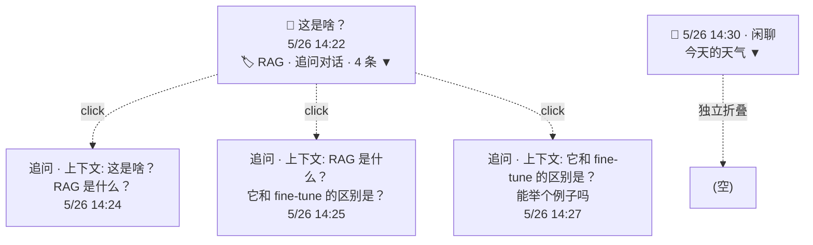

# 追问整树保存 — Context

> **立项性质**：**增量 PRD**（基于「追问树形索引」已落地的 UI 层，往下接"保存时父子关系从未启用"的洞）。
> **承接关系**：上文 `dev/active/追问树形索引/` 的 UI 索引层（`card-tree.tsx` + `TreeIndexLayer`）已经能用，本 PRD 只补"保存"语义。
> **用户拍板日**：2026-09-08。**四项关键决策用户已确认**，详见下表，不要再问。

## 背景 / 痛点

- **多轮追问后保存体验断裂**：解释卡支持无限追问（递归 `ExplainCard`），但保存 API 的 `parentId` 入参从扩展侧**从未传过**——`ExplainCard.postNote` 直接把子卡当孤儿 note 入库（`ExplainCard.tsx:285-291`）。结果：用户辛苦追问了四五条，回头发现笔记本里全是独立卡片，**追问上下文全部丢失**。
- **后续反向污染**：`POST /api/notes` 入库即那一刻的快照（`saveNote` 是 INSERT），但卡片侧仍在流式渲染/追问——若不明确"已存 ≠ 活卡"的语义边界，用户会以为"卡片和笔记是双向同步"，但实际是单向快照，没有任何同步逻辑。
- **Web 笔记本侧看不到树**：`app/notebook/page.tsx` 把所有 note 平铺时间线，`parentText` 只在展开单条时作为"追问时的上下文"显示（`page.tsx:363-368`）。即使 DB 已存父子关联，前端也没聚合——用户看不出哪些是同一棵追问树。

## 现状（调研）

| 项 | 结论 | 文件指针 |
|---|---|---|
| 卡片树结构 | ExplainCard 递归自渲染，根挂 `CardTreeProvider`，children 是局部 state；根卡 `selfId` 一次性生成 | `chrome-extension/src/content/ExplainCard.tsx:111, 726-732`、`card-tree.tsx` |
| 树形索引浮层 | 已完成（导航/跳转）：节点 = 问题文本、flash 高亮、阈值 `maxDepth≥2 || totalCards-1≥3` | `ExplainCard.tsx:753-854`、`card-tree.tsx:60-62` |
| 保存 API | `POST /api/notes` 已支持 `parentId` / `parentText` / `clientNoteId` / `tags` / `source`（schema 早就在） | `app/api/notes/route.ts:54-76` |
| DB schema | `notes` 表已有 `parent_id` / `parent_text` / `client_note_id` 列 + `notes_user_client_note_unique_idx`（保证 clientNoteId 幂等） | `db/migrations/20260426_notebook_multi_user.sql` |
| DB 写入层 | `saveNote(ctx, input)` 已实现整段 INSERT；migrateGuestNotes 支持 clientNoteId 去重 | `lib/db/notes.ts:78-99, 166-214` |
| 笔记本 UI | 时间线平铺，`parentText` 仅展开时显示「追问时的上下文」（不渲染树） | `app/notebook/page.tsx:240-253, 363-368` |
| **扩展侧未启用 parentId** | `ExplainCard.postNote` 没传 `parentId`（line 285-291），子卡保存**全是孤儿** | `ExplainCard.tsx:285-291` |
| 现有的「覆盖旧的」 | 根卡保存时按 `text` 查重，命中同输入无父的 note → 「都保留 / 覆盖旧的」 | `ExplainCard.tsx:269-283, 359-368, 641-661` |
| 端到端 readme 入口（前端） | 直读 `getNotes` 全量拉，前端再聚合；无后端 join | `app/notebook/page.tsx:54-75`、`lib/db/notes.ts:67-76` |
| Guest 笔记 | localStorage 存 clientNoteId；migrateGuestNotes 已预留 parentText | `lib/guest-notes.ts`、`lib/db/notes.ts:166-214` |
| API/DB 客户端封装 | Web 侧 `createNote` 已接受 `clientNoteId`，但不接受 `parentId`（差量） | `lib/api/notes-client.ts:29-46` |

## 用户已确认的关键决策（2026-09-08 拍板，不要再问）

| # | 决策点 | 选择 | 含义 |
|---|---|---|---|
| 1 | 保存范围 | **A. 默认整树保存** | 根卡 footer「存入笔记本」= 整棵追问树一次性入库，每条 note 带正确 `parentId`。子卡可单独存（不建关联）。 |
| 2 | 同步策略 | **A + B. 快照 + 手动更新** | 存完即那一刻的快照，**不**自动同步；卡片侧继续追问/修改不回写已存笔记。已存后多一个「更新到笔记本」按钮，整树覆盖式更新。 |
| 3 | 笔记本里怎么显示 | **A. 折叠分组** | 一棵树=一行「对话（N 条）」，点开看时间线 + 每条追问保留上下文框。删除按根级联，改分类整组一致。**不**做树形渲染（保留为后续需求）。 |
| 4 | 子卡能不能单存 | **A. 允许** | 子卡 footer 保留「只存本条」独立入口，单存为独立 note（**不**传 parentId）。和整树存互不干扰。 |

## 约束（落地硬约束）

- **最小变更原则**：能复用就复用。`POST /api/notes` 接口不动 schema（`parentId`/`parentText`/`clientNoteId` 早就在）。DB schema 也不增列。
- **平行实现警示**：`components/ExplanationCard.tsx`（Web 解释卡）**没有**追问树，本功能**仅扩展侧**有保存树的语义；**Web 笔记本页面要改**（笔记本页是 Web 侧，本就要聚合树的展示）。
- **代码地图强校验**：本功能涉及 + 新增的源文件必须收录 `docs/map/ext-content.md` 与 `docs/map/web-ui.md`，否则 `scripts/check-map.mjs` 红。
- **退路**：整树保存失败 → 自动降级为只存本条（不允许无声失败）。整树保存按钮 = "存根 + 递归存子"，任一 POST 500/网络断：已成功的部分保留为已存 note 并在 UI 标红。
- **clientNoteId 唯一性**：DB 已有 `notes_user_client_note_unique_idx`，根用一个 `crypto.randomUUID()` 一次性给所有本树 note（**含孙卡**）共用，便于「更新」按 clientNoteId 反查覆盖。子卡单存走自己的 clientNoteId（独立）。
- **不阻塞**：父卡保存成功后，子卡保存失败怎么办？见「待明确事项 #2」。

### 我补充发现的额外约束

- **状态语义要清晰**：「已存」是**根卡**的 savedId（根才有），子卡 footer 仍显示自己独立的存/未存。已存后用户继续追问，已存的根和子**都不**重新写——直至点「更新到笔记本」才整树覆盖。
- **"整树更新"不是 PATCH，是 replace 语义**：更新按钮 = 删本树旧 note（按根 clientNoteId）+ 重存当前卡片状态。和现有「覆盖旧的」行为一致（区别在于覆盖范围：旧版只覆盖根单条；新版整树覆盖）。
- **guest / 子卡单存交互**：guest 模式下子卡单存走 `saveGuestNote` 老逻辑（无 parentId）；根卡整树保存时也是 guest → 走 localStorage 循环 + 一个根 clientNoteId 复用为树锚。和账号版语义对齐。
- **保存按钮区最大化**：扩展卡片宽 360px，footer 已经塞 4 个动作（保存/打开笔记本/追问/tag 提示）。整树按钮 + 次级 "只存本条" + 已存标签 + 更新按钮——**文案要短**，必要时把 "打开笔记本" 移到 header 设置里（先观察，不动）。

## 依赖与风险

| 项 | 说明 |
|---|---|
| **API/DB 侧依赖** | `POST /api/notes` 现有签名已含 `parentId`/`parentText`/`clientNoteId`，**不需要后端改动**；唯一新增是 `deleteNote`/列表查子（更新阶段要走 `GET /api/notes?...` 或新加 `?clientNoteId=` 过滤——见「待明确事项 #1」） |
| **前端聚合** | 笔记本页面新增"按 parentId 分组"的客户端聚合层（`app/notebook/page.tsx`），零后端改动 |
| **代码地图同步** | `docs/map/ext-content.md`（ExplainCard 行更新；footer 按钮行为更新）、`docs/map/web-ui.md`（page.tsx 行更新） |
| **风险 1：整树保存中途网断** | 已存部分成功、后续失败——必须「降级 + 标红 + 提供单点重试」，决策见待明确 #2 |
| **风险 2：客户端时间 / 浏览器时钟篡改** | savedAt 用服务端时间（`saveNote` 不带），OK |
| **风险 3：clientNoteId 冲突** | UUIDv4 在用户域内几乎不可能冲突，但 DB unique index 保险 |
| **风险 4：删除级联穿透 guest** | 账号用 DB CASCADE 或后端逻辑；guest 是 localStorage，**前端聚合时过滤**即可 |
| **风险 5：笔记本端改 tags 跨账号** | 父卡 tags 改动 = 整组同步改子卡 tags（API 是按 id 一条改的；前端遍历子 id 串行 PATCH） |
| **回滚** | 关闭 footer 「整树保存」按钮 + 还原原 `handleSave` 即可，无 DB/网络副作用 |

## 待明确事项（我作为 PM 的推荐已附，不要全部抛给三角）

| # | 待明确点 | 我的推荐 | 理由 |
|---|---|---|---|
| 1 | 更新用「整树覆盖」还是「按 savedAt 差量」？ | **整树覆盖**（按 clientNoteId 反查 → 删所有 `clientNoteId = 根 clientNoteId` 的 note → 重存当前卡片快照） | (a) 决策 2 是"快照"语义——更新按钮就应是"用当前快照写过去"；差量混着用户对子卡的独立编辑会让"快照"语义混乱。(b) API/DB 几乎零改动，复用现有 `DELETE /api/notes/:id`（前端循环删即可）。(c) 差量要解决"用户在笔记本端删了某子卡 → 重新树覆盖回来"这种边角，复杂度不值。 |
| 2 | 整树保存中途部分失败 → 整树回滚 vs 允许部分成功？ | **允许部分成功 + UI 明确标红 + 提供重试** | (a) 用户决策 1「默认整树保存」= 期望方便，失败不应清空已成功的部分。(b) 一致性可在 UI 层补：保存后 footer 显示「✓ 4/6 条已存，2 条失败，点此重试」。(c) 整树回滚会触发"我的追问全没了！"的惊吓——体验不可接受。 |
| 3 | 已存后的子卡，用户在子卡 footer「只存本条」会发生什么？ | **允许**——单存为独立 note（无 parentId）；**不进**已存整树的 clientNoteId 集合 | (a) 决策 4 明示子卡可单存，单存的语义就是「这条我想单独留一份」(b) 不会被"更新到笔记本"意外覆盖——客户端的 clientNoteId 永远不重 (c) 但**已存整树的根/其他子卡**不能因为"我单存了这条孙卡"而被牵连进整树——clientNoteId 是"树 ID"不是"卡片 ID"，孙卡的 clientNoteId == 根的 clientNoteId 都属于同一棵。 |
| 4 | 整树保存期间用户继续追问（保存发起后 children state 新增） | **保存发起时锁定子树快照**——保存按钮点下的瞬间把"当前 children 列表 + 每个子卡的 input/explanation"打包为一个不可变快照，循环 POST 用快照源，不引用 children state（避免 React 重渲染后改写快照源） | (a) React state 在异步保存期间会变（用户继续追问是合理的）(b) 用户体验：点保存后他能立即继续追问，新追问不会自动入库——符合决策 2「不自动同步」语义 (c) 写代码时把 children + 递归子卡的 `text`/`explanation` 拍成一张不可变表 (snapshot)`Map<cardId, {text, explanation, children: [...]}>`,只对快照做 POST |
| 5 | 根卡 footer「存入笔记本（连同 N 条追问）」按钮位置 vs. 原「存入笔记本」 | **替换**——主按钮文案改成「存入笔记本（连同 N 条追问）」；"只存本条" 降级为次级按钮（小号 / 浅色），仅在 N>0 时显示 | (a) 决策 1「默认整树保存」——大多数情况下用户想要整树 (b) 单卡的「只存本条」依然可见，但不喧宾夺主 (c) 保留现有「覆盖旧的 / 都保留」重复确认弹窗——查重逻辑需扩展支持父子（见 #6） |
| 6 | 整树保存时的查重语义（同名同输入重复弹窗） | **保留**——但**只在根 inputText 命中**且旧 note 也是 parentId=null 的根 note 时弹 | (a) 避免子卡 input 串到根查重里触发误弹（子卡本来就是根的追问，inputText 可能重复）(b) 命中"老整树"时弹"覆盖" = 整树覆盖式更新；命中"单条根 note"时弹"覆盖" = 仅根覆盖（用户可手动再触发"更新"重存子） |
| 7 | Web 笔记本侧：分类筛选时折叠分组怎么处理 | **整组命中即命中**——只要父卡命中分类，整组可见（不命中 → 折叠不显示） | (a) 用户决策 3「改分类整组一致」——分类本就是组级元数据 (b) 实现：先筛 root notes（parentId 不存在），子卡仅在父卡可见时显示 |
| 8 | Notebook 端能看到"这是棵追问树"的视觉提示 | **父卡行加 🪢 / 「对话」徽章**(不算 emoji 装饰，仅文字徽章「追问对话 · N 条」) | 用户决策 3 明示要 N 条徽章；不强制表情符号，参考现有"追问" 橙色文字样式（`page.tsx:335-337`） |

> **决策清单（不让主理人再逐一拍板）**：以上 8 项为 PM 内部决策，**主理人审阅时仅需 #5（footer 按钮文案与次级）+ #7（分类筛选语义）需要 sign-off**；其余按推荐实现，dev-preview 阶段发现体验问题再调。

## UX 草图

### A. 扩展根卡 footer 变化（ASCII）

```
未登录:
  [登录后可保存]                       ·   [打开笔记本]   ·   [追问]

未追问（N=0）保存中:
  [保存中…]

已存 N=0 时（无追问时的旧体验）:
  [✓ 已存入笔记本]                     ·   [打开笔记本]   ·   [追问]

未存 N>=1（默认主按钮=整树）:
  [存入笔记本（连同 3 条追问）] [只存本条] ·   [打开笔记本]   ·   [追问]   🏷 tag

未存 N>=1 且查重命中:
  [都保留] · [覆盖旧的]
  小字提示: "将覆盖旧的整棵追问树（4 条）"
                                                   ← (与旧的「覆盖旧的」共用弹窗，加 N 条提示)

已存 N>=1:
  [✓ 已存 1+3 条] [更新到笔记本]       ·   [打开笔记本]   ·   [追问]

保存失败 (部分成功 k/n):
  [⚠️ 已存 2/4 条，重试 [失败项]]      ·   [打开笔记本]   ·   [追问]
```

子卡 footer（不显示整树按钮）:
```
[存入笔记本]                       ·   [追问]   ← 现有，保持；走旧查重/单条覆盖逻辑
```

### B. Web 笔记本列表折叠分组（mermaid）



实现：`app/notebook/page.tsx` 渲染时先按 parentId 分桶（notes with `parentId === undefined` 是 root），root 行显示「追问对话 · N 条」徽章 + 折叠行内嵌子卡；子卡行不显示自己的"对话 N 条"徽章。**不**做嵌套层级（决策 3：A 折叠分组），整棵树 = 父卡 + 子卡列表（兄弟序按时间线）。

## P0 / P1 / P2 需求池

### P0 — 必做（MVP，整树保存可用）

1. **扩展：根卡 footer 整树保存按钮**
   - 文案：「存入笔记本（连同 N 条追问）」、`N = 子卡总数`、子卡总数 0 时回退旧文案
   - 行为：拍快照 → 根 POST 拿 id → 子卡递归 POST 传 parentId/parentText → 任一失败标红
   - 单点重试：失败 UI 提供"重试失败项"

2. **扩展：clientNoteId 复用**
   - 根用一次性 `crypto.randomUUID()`，所有本树 note 共用之，便于更新时反查

3. **扩展：「更新到笔记本」按钮**
   - 已存态多一个次级按钮；行为 = 按根 clientNoteId 查所有本树 note → 循环 DELETE → 整树重存（与"覆盖旧的"语义一致）

4. **扩展：子卡 footer「只存本条」独立入口**
   - 单存为独立 note（不传 parentId），走老查重逻辑；不参与已存整树的更新覆盖

5. **API/DB：反查整树用现有 GET 过滤**
   - 复用 `GET /api/notes` 全量拉 + 前端按 `clientNoteId` 过滤；**不**新增 API 端点

6. **Web 笔记本：客户端聚合折叠分组**
   - 按 parentId 分桶、root 行带「追问对话 · N 条」徽章、展开后显示子卡时间线
   - 分类筛选：root 命中 → 整组可见；root 未命中 → 整组隐藏
   - 删除级联：删 root → 前端一次性把所有子卡 id 也发 DELETE；UI 弹「将同时删除 N 条追问」二次确认

7. **Web 笔记本：父卡 tags 改动整组同步**
   - 父卡 tags 编辑保存后，前端遍历子卡 id 串行 PATCH（沿用 `patchNoteTags`）

8. **退路**：整树 POST 任一 5xx → 该条标红，其余保留为已存；自动降级按钮只在 N>0 时显示

### P1 — 增强（MVP 之后立即可做）

9. **差量更新语义（待 P0 跑稳再加）**：见待明确 #1，反向。当前 P0 用整树覆盖。
10. **「更新到笔记本」前的变化 diff 预览**：根卡点更新按钮时弹窗"当前卡片 vs 已存笔记"的字段 diff（inputText / explanation / 子卡列表）—— dev-preview 阶段看用户反馈决定要不要。
11. **没注册扩展直接保存整树失败时的引导**：账号登录态但 token 过期时各子卡 POST 401 → 自动 ensureFreshAuth 后重试一次（沿用现有 `saveWithToken` 的 401 兜底）；不需要新建路径。

### P2 — 后续（独立需求评估）

12. **笔记本端树形渲染**：决策 3 显式不做，留为后续需求。
13. **侧栏/抽屉式追问树回放**：用已存的 parentId 关系，还原扩展侧的"树形索引层"在 Web 端也能跳读。
14. **跨设备同步**：当前 clientNoteId 是浏览器内生成，账号版用 DB unique index 保证幂等；后续可探索"浏览器 → DB 再 → 其他设备"的同步策略。

---

## 涉及文件（落地实施地图）

> 此清单**必**录入 `docs/map/ext-content.md` 与 `docs/map/web-ui.md`，否则 `scripts/check-map.mjs` 校验失败。

| 文件 | 变更类型 | 说明 |
|---|---|---|
| `chrome-extension/src/content/ExplainCard.tsx` | 改 | footer 三态（未存/已存/部分失败）+ 整树保存 + 更新按钮 + 子卡只存本条 |
| `chrome-extension/src/content/card-tree.tsx` | **新增工具方法**（沿用现有 Provider） | `flattenTree(tree)` 把注册表里的卡片数据拍成 `{cardId, text, explanation, parentCardId, depth}[]`，整树保存时按此构建 snapshot |
| `app/notebook/page.tsx` | 改 | 按 parentId 分桶聚合 + 父卡徽章 + 整组级联删除 + 父卡 tags 整组同步 |
| `app/api/notes/route.ts` | 不动 | schema 已含 parentId/parentText/clientNoteId |
| `lib/db/notes.ts` | 不动 | saveNote 已正确 |
| `lib/api/notes-client.ts` | 改 | `createNote` 入参加 `parentId?: string`（扩展侧链路） |
| `docs/map/ext-content.md` | 改 | 收录 ExplainCard footer 新增行为 + `card-tree.tsx` 新增的纯函数 |
| `docs/map/web-ui.md` | 改 | 收录 `page.tsx` 折叠分组 |
| `__tests__/card-tree.test.ts` | 加 | `flattenTree` + 整树 POST 循环去重——单测，纯函数优先 |

---

## 文档索引

- [`追问整树保存-plan.md`](./追问整树保存-plan.md) — 极简实施计划（≤80 行）
