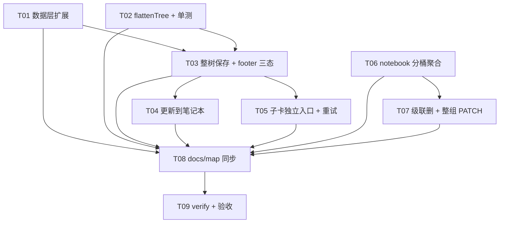

# 追问整树保存 — Tasks（原子任务列表）

> **承接**：[plan.md](./追问整树保存-plan.md) 5 阶段顺序；[architecture.md](./追问整树保存-architecture.md) 的接缝与权衡。
> **硬约束**：API/DB 0 改动；依赖包 0；最多 10 个原子任务；每个 ≥ 3 文件。

## 任务总览

| # | 标题 | 阶段 | 依赖 | 类型 |
|---|---|---|---|---|
| T01 | 数据层扩展（notes-client + guest-notes + 单测基线） | Step 0 | — | 改动 |
| T02 | card-tree flattenTree 纯函数 + 单测 | Step 1 | — | 改动 |
| T03 | ExplainCard 拍快照 + 整树 POST 循环 + footer 三态 | Step 1 | T01, T02 | 改动 |
| T04 | ExplainCard「更新到笔记本」按钮 + 整树覆盖 | Step 2 | T03 | 改动 |
| T05 | ExplainCard 子卡「只存本条」独立入口 + 失败子卡重试 | Step 3 | T03 | 改动 |
| T06 | notebook 按 parentId 分桶 + 父徽章 + 折叠 | Step 4 | — | 改动 |
| T07 | notebook 级联删除 + 父卡 tags 整组 PATCH | Step 4 | T06 | 改动 |
| T08 | docs/map 三卷同步（ext-content / web-ui / lib-core） | Step 5 | T01-T07 | 改动 |
| T09 | npm run verify 全绿 + 手动验收清单 | Step 5 | T01-T08 | 验证 |

---

## T01. 数据层扩展（notes-client + guest-notes + 单测基线）

**范围**
- `lib/api/notes-client.ts:29-46`：`createNote` 的 payload 类型加 `parentId?: string`，函数体不变（直接走 `JSON.stringify(payload)`，新字段自动透传）。
- `lib/guest-notes.ts:1-10`：`GuestNote` 接口加 `parentId?: string`；新增导出 `saveGuestNotes(notes: GuestNote[])`（批量版，原子更新 localStorage）。

**依赖**：—

**验收**
- `tsc --noEmit` 通过；`grep -n 'parentId' lib/api/notes-client.ts` 有命中。
- `__tests__/guest-notes.test.ts` 若存在则加 `parentId` 字段往返用例；不存在则跳过（最小变更）。
- 老调用 `createNote(token, { inputText, explanation })` 不破（TypeScript 可选字段）。

**风险**：无；签名扩展，老调用方零改动。

---

## T02. card-tree.tsx 加 `flattenTree` 纯函数 + 单测

**范围**
- `chrome-extension/src/content/card-tree.tsx:25-34`：扩展 `CardNodeRecord` 接口加 `getExplanation: () => string`。
- 同文件：导出新纯函数 `flattenTree(nodes, explanations, rootExplanation)`，签名见 architecture §3.2，BFS 输出。
- `__tests__/card-tree.test.ts`：新增 `describe('flattenTree')` 含 4 例（空树 / 单层根+2 子 / 多层 根→子→孙 / BFS 顺序）。

**依赖**：—

**验收**
- 单测全绿：`npm test -- card-tree`。
- flattenTree 是 pure function（无 React hooks 依赖），便于 Vitest node 环境直跑。
- getExplanation 字段加进后现有 `CardTreeRegistration` 调用方传 `() => explanationRef.current`（ref 持锁实现见 T03）。

**风险**：现有 `CardNodeRecord` 字段加可选，TypeScript 严格模式下要求 `CardTreeRegistration` 调用方必填——需同步 T03。

---

## T03. ExplainCard 拍快照 + 整树 POST 循环 + footer 三态

**范围**
- `chrome-extension/src/content/ExplainCard.tsx`：
  - 新增 `explanationRef = useRef('')` + `explanationRef.current = explanation`（每次渲染同步）。
  - `CardTreeRegistration` 传 `getExplanation={() => explanationRef.current}`。
  - 新增 `handleSaveTree()`（拍快照 → `flattenTree` → 循环 POST → 设 savedId + failed）。
  - footer 主按钮（root 且 children.length>=1）：「存入笔记本（连同 N 条追问）」。
  - footer 次级按钮（root 且 children.length>=1）：「只存本条」→ 走老 `handleSave`。
  - footer 已存态：「✓ 已存 X/Y 条」 + 「更新到笔记本」（具体见 T04）。
  - footer 部分失败态：「⚠️ 已存 X/Y 条」，失败子卡 footer 单独标红（见 T05）。

**验收**
- 手动：主卡 + 2 追问 → 点整树保存 → DB 有 3 条 note（parent_id 链正确）+ footer「✓ 已存 3 条」。
- 手动：保存发起后继续追问 → 新追问不入库（snapshot 隔离）。
- 单测：`flattenTree` 覆盖；ExplainCard 渲染快照测试（如能 mount）。

**风险**：getExplanation 必须用 ref，否则闭包陈旧（W1）；snapshot 必须 useState 一次性建表，循环里不读 children state。

---

## T04. ExplainCard「更新到笔记本」按钮 + 整树覆盖

**范围**
- `ExplainCard.tsx`：根 savedId != null 时 footer 显示「更新到笔记本」按钮。
- 新增 `handleUpdateTree()`：GET /api/notes 全量 → 按 `根 clientNoteId` 过滤 → 循环 DELETE → 拍快照 → 走 T03 同样的 saveTree 流程。
- 新增 `handleReplaceTree()`（用于 T03 查重弹窗的「覆盖旧的」按钮）：同 handleUpdateTree 但用现有根 clientNoteId 替代旧 note。

**验收**
- 手动：保存后新增 1 条追问 → 点「更新」→ DB 旧 3 条删 + 新 4 条入（clientNoteId 不变）。
- 手动：根 inputText 查重命中 → 弹窗「覆盖旧的」= 整树覆盖。

**风险**：DELETE 失败时不要断流程（继续 POST 新数据），已删 note 在 UI 显示即可。

---

## T05. ExplainCard 子卡 footer「只存本条」独立入口 + 失败子卡重试

**范围**
- `ExplainCard.tsx`：子卡 footer（depth>0）显示「只存本条」按钮（沿用老 `handleSave`，不传 parentId，clientNoteId 用子卡独立 UUID）。
- 子卡独立 `savedId` 状态独立维护（既有的 `savedId` 已经是每卡一个 state，无需改）。
- 失败子卡 footer：「⚠️ 保存失败 [重试]」，重试仅 POST 该条（单条 saveTree）。

**验收**
- 手动：子卡点「只存本条」→ DB 新增独立 note（parent_id IS NULL）。
- 手动：根整树保存时模拟子卡 POST 失败 → 子卡 footer 红框 + 「重试」按钮 → 点重试 → 该条入库。
- 子卡独立保存不影响根整树 clientNoteId。

**风险**：无；纯新增，不动老路径。

---

## T06. notebook 按 parentId 分桶 + 父徽章 + 折叠

**范围**
- `app/notebook/page.tsx`：
  - 新增聚合函数 `groupByParent(notes): { rootNotes, childrenByParentId }`，root = `!n.parentId`，children 按 `n.clientNoteId === root.clientNoteId` OR `n.parentId === root.id` 分桶（决策 8 视实现选其一，**优先 clientNoteId 共享**，因整树 clientNoteId 唯一）。
  - 替换 `visibleNotes.map(<NoteCard/>)` 为 `rootNotes.map(<TreeNoteCard root children .../>)`。
  - `TreeNoteCard`：父卡行加「追问对话 · N 条」徽章 + 展开行内嵌子卡时间线（复用现有 `NoteCard` 的展开区）。
  - 分类筛选：root 命中 → 整组可见（root 未命中 → 整组隐藏），实现：`visibleNotes` 改为「root 命中 + child.parentId IN visibleRootIds」。

**依赖**：—

**验收**
- 手动：账号版 → 笔记本 → 一棵追问树显示 1 行父 + 「追问对话 · 4 条」徽章 + 展开看 4 条子卡。
- 手动：guest 版 → 同语义（localStorage parentId 字段）。
- 手动：分类筛选「RAG」→ 父卡有 RAG → 整组（含子卡）可见；父卡无 RAG → 整组隐藏。

**风险**：clientNoteId 共享决策需后端支持——已确认 DB unique index 允许多 note 同 clientNoteId（不同 id）。

---

## T07. notebook 级联删除 + 父卡 tags 整组 PATCH

**范围**
- `app/notebook/page.tsx:96-105 handleDelete`：扩展为「ids = [root.id, ...children.map(c=>c.id)] + 二次确认（仅 N>=1 时弹）」，循环 DELETE。
- `page.tsx:107-124 handleUpdateCategory`：扩展为「ids = [root.id, ...children.map(c=>c.id)]」串行 PATCH `patchNoteTags`。
- guest 路径同样扩展：`removeGuestNotes(ids)` 新增（批量），`updateGuestNoteTags(id, tags)` 已支持。

**验收**
- 手动：删父卡 → 弹「将同时删除 N 条追问」→ 确认 → DB 整组消失。
- 手动：父卡 tags 改 RAG → 整组（含子卡）DB tags 同步变 RAG（子卡列表刷新可见）。

**风险**：级联 PATCH 失败时单条标红 + 重试（沿用决策 #2 部分成功策略）。

---

## T08. docs/map 三卷同步

**范围**
- `docs/map/ext-content.md`：ExplainCard.tsx 描述行加「footer 三态 + 整树 POST + 更新按钮 + 子卡独立入口」；card-tree.tsx 行加「flattenTree 纯函数 + getExplanation 持锁 ref」；新增 `__tests__/card-tree.test.ts` 的 flattenTree 用例引用。
- `docs/map/web-ui.md`：app/notebook/page.tsx 行加「按 parentId 分桶聚合 + 父徽章 + 折叠 + 级联删 + 整组 PATCH」。
- `docs/map/lib-core.md`：lib/api/notes-client.ts 行加「createNote 入参 +parentId」；lib/guest-notes.ts 行加「GuestNote.parentId + saveGuestNotes 批量」。

**依赖**：T01-T07（地图必须反映所有改动）

**验收**
- `node scripts/check-map.mjs` 0 报错：`覆盖 X 个源码文件，无失效路径`。

**风险**：必须先确保 T01-T07 的所有源文件（含新增导出）都被反引号列在地图里。

---

## T09. npm run verify 全绿 + 手动验收清单

**范围**
- 跑 `npm run verify`（check-map → lint → vitest → build → 扩展 build）全绿。
- 跑一遍 plan.md 的「PM 验收要点」手动清单：根 0 追问兼容 / 整树 + 更新 + 失败重试 / 子卡独立存 / Web 折叠 + 整组 PATCH + 级联删 / guest 同语义。
- （可选）E2E 跑扩展内保存 → 重开 session → 笔记本拉列表 → 父徽章正确 + 子卡 parentText 等于根 inputText。

**依赖**：T01-T08

**验收**
- `npm run verify` 退出码 0。
- 手动清单 8 项全勾。
- check-map 0 stale 0 missing。

**风险**：E2E 扩展侧跑通需要 `npm run test:e2e:ext`（plan.md 提到），若环境不具备可在文档里标「E2E 跳过，手动验收」，不阻塞 P0 上线。

---

## 任务依赖图

